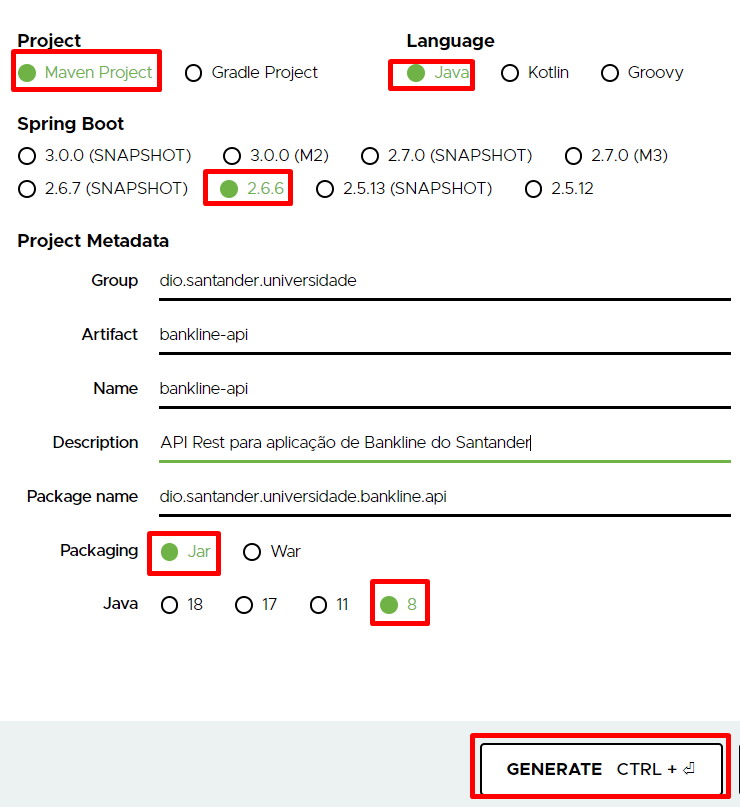

# Projeto

O projeto será baseado na proposta de um Bankline para gestão de correntistas e movimetações de receitas e depesas com base na diagramação baixo.

.png>)

Requisitos:

* Implementar com base em uma arquitetura **MVC**
* Incorporar numa plataforma de inversão de controle e injeção de dependência como o **Spring**
* Interação com banco de dados através do framework ORM **Hibernate**
* Disponibilizar a API Rest devidamente documentada através do **Swagger**
* Publicar em um container para disposição os nossos serviços de forma pública como o **Heroku**

### Spring Initializr

Site que oferece os recursos para criação de um projeto Spring Boot com uso Maven ou Gradle

* Acesse o site: [`https://start.spring.io/`](https://start.spring.io)``
* Selecione a opção Maven Project
* Selecione a opção Language - Java

Preenchimento

* **Group:** Nome do grupo organizacional
* **Artifact:** Identificação do projeto
* **Name**: Nome do Projeto (igual ao artifact)
* **Description:** Descrição do Projeto
* **Package Name:** Nome do pacote raíz da sua aplicação
* **Packaging:** Tipo de Build da sua aplicação, pode manter **.jar**
* **Java:** Versão do Java JDK e JRE que está utilizando

Clique no botão **GENERATE** para realizar o download,  extraia o aquivo **.zip** e em seguida importe na IDE Eclipse.


NOTA: Ainda não incluímos nenhuma dependência de acesso a dados e web e recomendados que você extraia o **bankline-api.zip** na pasta **c:\estudos** devendo ficar **c:\estudos\bankline-api**


.png>)

Inciando o Eclipse para importar o projeto Springboot
